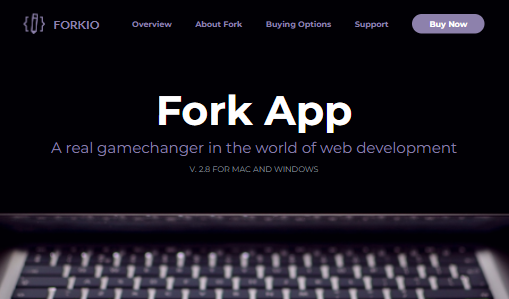

# Forkio 

## Step Project
Advanced HTML and CSS
______ 

## Description
This project is the result of a course advansed CSS and HTML. This is imitation of landing page.
 It  adaptive and responsive to various screen extensions.

## Authors and acknowledgment
This project ctreated by  [Olena Chizhevska](https://gitlab.com/OlenaChi) and [Tetiana Yatskova](https://gitlab.com/t.yatskova)

Thanks for support our moderator _Vadym Tartakovskyi_

### Distribution of tasks

+ Olena Chizhevska
    + gulpfile
    + section "header"
    + section "people"

+ Tetiana Yatskova
    + section "presents"
    + section "features"
    + section "pricing"

+ Both members
    + readme.md

## How we made this work

**Technologies used** in the project:
- JavaScript toolkit gulp

- SCSS - Sassy Cascading Style Sheets

- Java Script for primitive functional page

- HTML 5 facilities

- adaptive and responsive layout

- BEM methodology

## Visuals


## Installation
to _start_ the project use next command

```
npm install

npm run build
```


for develope use command

```
npm run dev
```

## Usage
You must install  JavaScript toolkit **gulp** for the  correct operation of the page.

## Project status
We will consider your comments and suggestions
